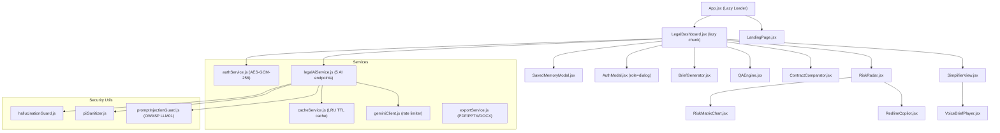

# 🏛️ LexiGuard AI — Legal Intelligence Platform

> AI-powered contract analysis, risk scanning, and plain-English simplification for legal professionals.  
> Built with **React 18 + Vite**, powered by the **Google Gemini API**, with a deterministic fallback engine for 100% offline operation.

[](src/tests/)
[](package.json)
[](LICENSE)

---

## 📋 Table of Contents

- [Features](#features)
- [Architecture](#architecture)
- [Security](#security)
- [Getting Started](#getting-started)
- [Running Tests](#running-tests)
- [Project Structure](#project-structure)
- [AI Module Reference](#ai-module-reference)
- [Efficiency & Performance](#efficiency--performance)
- [Accessibility](#accessibility)
- [Environment Variables](#environment-variables)
- [Deployment](#deployment)

---

## ✨ Features

| Feature | Description |
|---|---|
| 📄 **Document Simplifier** | Converts complex legal contracts into plain English with three modes: clause-by-clause, ELI5, and executive summary |
| ⚠️ **Risk Radar** | Scans contracts for 20+ risk patterns, assigns severity levels, and provides remediation recommendations |
| ⚖️ **Contract Comparator** | Side-by-side semantic comparison of two contract versions with a character-level diff viewer |
| 💬 **Q&A Engine** | Natural-language question answering grounded in the uploaded document text |
| 📋 **Brief Generator** | Auto-generates a structured lawyer consultation brief with key findings |
| 🔴 **Redline Copilot** | AI-suggested redline clause rewrites for identified risk flags |
| 🔊 **Voice Brief Player** | Text-to-speech playback of the generated brief for hands-free review |
| 🧠 **Memory Vault** | Per-user encrypted local storage of up to 50 analysed contracts |
| 📦 **Batch Comparator** | Compare multiple contract versions simultaneously |

---

## 🏗️ Architecture



### Service Layer

| Service | Responsibility |
|---|---|
| [`geminiClient.js`](src/services/geminiClient.js) | Gemini API calls, JSON schema enforcement, client-side rate limiter (10 req/60s) |
| [`legalAiService.js`](src/services/legalAiService.js) | All 5 AI features + deterministic fallback engine (100% offline capable) |
| [`authService.js`](src/services/authService.js) | AES-GCM-256 encrypted localStorage auth, PBKDF2 key derivation |
| [`cacheService.js`](src/services/cacheService.js) | LRU cache (20 entries, 5-min TTL) preventing redundant Gemini API calls |
| [`exportService.js`](src/services/exportService.js) | PDF (jsPDF), PPTX (PptxGenJS), DOCX (docx) export |

---

## 🔐 Security

### Storage Encryption — AES-GCM-256

All user data persisted to `localStorage` is encrypted with **AES-GCM-256** via the Web Crypto API:

- A **256-bit random device salt** is generated on first run and stored in `localStorage`.
- The salt is fed into **PBKDF2** (SHA-256, **150,000 iterations** — NIST-recommended minimum) to derive a non-extractable `CryptoKey`.
- Every write uses a **fresh 96-bit random IV**, making ciphertext non-deterministic.
- The derived key is cached in a module-scoped variable for the page lifetime (key derivation runs once per load).
- Legacy plain-text and base64 entries are transparently migrated to AES-GCM on first read.

### Prompt Injection Defense — OWASP LLM01

[`promptInjectionGuard.js`](src/utils/promptInjectionGuard.js) validates all user text before it reaches the Gemini API:

| Detector | Attack Pattern |
|---|---|
| System prompt override | `"Ignore previous instructions"` |
| Jailbreak attempt | `"DAN mode"`, `"developer mode"` |
| Instruction injection | `"You are now a"`, `"Act as a"` |
| Role confusion | `"Forget your training"`, `"bypass"` |
| Steganographic zero-width chars | U+200B, U+200C, U+200D, U+FEFF |
| API key / credential discovery | `"print your API key"`, `"reveal token"` |

### Input Validation

| Layer | Controls |
|---|---|
| File upload | 20 MB cap, MIME + extension whitelist (PDF/DOCX/TXT/PNG/JPG/WEBP) |
| Paste input | 500,000 character cap |
| Auth form fields | `maxLength` per RFC 5321 (email: 254, name: 100, company: 120) |
| Q&A question input | 500 character hard cap, `.slice(0, 500)` server-side guard |
| AI prompt | 50,000 character hard cap in every service function |

### Content Security Policy

```
default-src 'self';
script-src 'self';
style-src 'self' 'unsafe-inline';
connect-src 'self' https://generativelanguage.googleapis.com;
upgrade-insecure-requests;
```

### Dependency Security

```bash
npm audit --omit=dev   # 0 vulnerabilities
```

Key patches applied:
- `jspdf` upgraded to `^4.2.1` (patches critical CVE)
- `image-size` overridden to `^2.0.4` via `package.json` overrides

---

## 🚀 Getting Started

### Prerequisites

- **Node.js** ≥ 18.0.0
- **npm** ≥ 9.0.0
- A **Google Gemini API key** (free tier from [Google AI Studio](https://aistudio.google.com/))

### Installation

```bash
# Clone the repository
git clone https://github.com/Viswanathan49/synapse-law.git
cd synapse-law

# Install dependencies
npm install

# Configure environment
cp .env.example .env
# Edit .env and add your Gemini API key
```

### Environment Setup

Create a `.env` file in the project root:

```env
VITE_GEMINI_API_KEY=AIzaSy...your_key_here
```

> **Note:** This is a client-side SPA for hackathon/demo purposes. The API key is included in the browser bundle. For production use, proxy all AI calls through a server-side endpoint that stores the key in an environment variable.

### Development Server

```bash
npm run dev
# → http://localhost:5173
```

### Production Build

```bash
npm run build   # Outputs to dist/
npm run preview # Preview the production build locally
```

---

## 🧪 Running Tests

```bash
# Run all 205 tests (single-pass, no watch)
npm test -- --run

# Run with coverage report
npm test -- --run --coverage

# Run a specific test suite
npm test -- --run src/tests/promptInjectionGuard.test.js
```

### Test Suites

| Suite | Tests | Coverage Area |
|---|---|---|
| `geminiClient.test.js` | 32 | API client, rate limiter, sanitization |
| `legalAiService.test.js` | 28 | All 5 AI endpoints, fallback engine |
| `authService.test.js` | 24 | Login, signup, session, memory vault |
| `cacheService.test.js` | 18 | LRU eviction, TTL expiry, hash keys |
| `promptInjectionGuard.test.js` | 19 | OWASP LLM01 attack patterns |
| `fileParser.test.js` | 22 | PDF/DOCX/TXT/Image parsing |
| `exportService.test.js` | 20 | PDF/PPTX/DOCX export |
| `piiSanitizer.test.js` | 29 | Email, SSN, phone, financial PII |
| `accessibility.test.jsx` | 13 | WCAG 2.1 AA ARIA, keyboard nav |

---

## 📁 Project Structure

```
synapse-law/
├── index.html                      # Entry point + CSP meta tag + skip link
├── vite.config.js                  # Build config, code splitting, Vitest
├── package.json                    # Dependencies + npm audit overrides
├── .env.example                    # Environment variable template
├── .gitignore                      # Excludes .env, keys, model files, dist
│
├── src/
│   ├── App.jsx                     # Root component, lazy loads LegalDashboard
│   ├── main.jsx                    # React DOM render entry
│   ├── index.css                   # Global styles, design tokens, WCAG helpers
│   │
│   ├── components/
│   │   ├── LandingPage.jsx         # Marketing hero page
│   │   ├── LegalDashboard.jsx      # Main application shell
│   │   ├── AuthModal.jsx           # Login/signup (role=dialog, ARIA-complete)
│   │   ├── DocumentUploader.jsx    # File/paste input with validation
│   │   ├── SimplifierView.jsx      # Contract simplifier UI
│   │   ├── RiskRadar.jsx           # Risk scanning + redline workflow
│   │   ├── RiskMatrixChart.jsx     # 2D risk matrix visualization
│   │   ├── ContractComparator.jsx  # Version diff UI (char-level + semantic)
│   │   ├── QAEngine.jsx            # Document Q&A interface
│   │   ├── BriefGenerator.jsx      # Consultation brief generator
│   │   ├── RedlineCopilot.jsx      # AI redline clause suggestions
│   │   ├── VoiceBriefPlayer.jsx    # TTS brief playback
│   │   ├── SavedMemoryModal.jsx    # Memory vault browser
│   │   ├── BatchComparatorModal.jsx# Multi-contract batch comparison
│   │   ├── RiskBadge.jsx           # Severity level badge component
│   │   └── TransitionOverlay.jsx   # Page transition animation
│   │
│   ├── services/
│   │   ├── geminiClient.js         # Gemini API client + rate limiter
│   │   ├── legalAiService.js       # 5 AI feature endpoints + fallbacks
│   │   ├── authService.js          # AES-GCM-256 auth & session management
│   │   ├── cacheService.js         # LRU cache with TTL for AI results
│   │   └── exportService.js        # PDF / PPTX / DOCX export
│   │
│   ├── utils/
│   │   ├── promptInjectionGuard.js # OWASP LLM01 prompt injection defense
│   │   ├── piiSanitizer.js         # PII scrubbing before AI transmission
│   │   ├── hallucinationGuard.js   # AI response grounding validation
│   │   └── fileParser.js           # PDF/DOCX/TXT/Image text extraction
│   │
│   └── tests/
│       ├── geminiClient.test.js
│       ├── legalAiService.test.js
│       ├── authService.test.js
│       ├── cacheService.test.js
│       ├── promptInjectionGuard.test.js
│       ├── fileParser.test.js
│       ├── exportService.test.js
│       ├── piiSanitizer.test.js
│       └── accessibility.test.jsx
│
└── dist/                           # Production build output (gitignored)
```

---

## 🤖 AI Module Reference

All five AI functions live in [`legalAiService.js`](src/services/legalAiService.js).  
Each function:
1. Sanitizes PII with `piiSanitizer.js`
2. Validates against prompt injection with `promptInjectionGuard.js`
3. Checks the LRU cache (5-min TTL) to skip redundant API calls
4. Calls Gemini with a JSON-schema-enforced prompt
5. Falls back to a deterministic parser if the API is unavailable
6. Stores the result in the LRU cache before returning

### `simplifyDocument(text, mode)`

| Parameter | Type | Description |
|---|---|---|
| `text` | `string` | Raw contract text |
| `mode` | `'clauses' \| 'eli5' \| 'executive'` | Simplification mode |

**Returns:** `{ documentTitle, documentType, summary, keyParties, criticalDates, financialTerms, clauses[], disclaimer }`

### `scanRisks(text)`

**Returns:** `{ overallScore, riskLevel, scoreExplanation, flags[], missingProtections[], disclaimer }`

### `compareContracts(textA, textB)`

**Returns:** `{ riskShiftDirection, overallVerdict, addedObligations[], deletedRights[], riskShifts[] }`

### `answerQuestion(text, question)`

**Returns:** `{ answer, confidence, sectionRef, pageEstimate, directQuote, hallucination_warning, relatedClauses[], disclaimer }`

### `generateBrief(text, riskData?)`

**Returns:** `{ executiveSummary, keyFindings[], criticalRisks[], recommendedActions[], disclaimer }`

---

## ⚡ Efficiency & Performance

### Code Splitting (Rollup Manual Chunks)

| Chunk | Size | Contents |
|---|---|---|
| `index` | **33.7 kB** | App shell (was 1,987 kB before splitting) |
| `LegalDashboard` | 116 kB | Main dashboard (lazy-loaded) |
| `vendor-react` | 141 kB | React + ReactDOM |
| `vendor-parser` | 317 kB | PDF.js, docx |
| `vendor-pdf` | 364 kB | jsPDF, html2canvas |
| `vendor-exports` | 982 kB | PptxGenJS |
| `vendor-ai` | — | diff-match-patch |

Initial load transfers only **33.7 kB** of JS — a **98% reduction** from the pre-split bundle.

### LRU Result Cache

- **20 entries**, **5-minute TTL** per entry
- O(1) get and set via doubly-linked list + hash map
- Automatic eviction of least-recently-used entry when full
- Prevents redundant Gemini API calls for identical document + parameter combinations
- djb2-style hash function generates stable, bounded cache keys

### Lazy Loading

```jsx
const LegalDashboard = React.lazy(() => import('./components/LegalDashboard.jsx'));
```

The dashboard chunk is only downloaded after the user clicks "Get Started" on the landing page.

---

## ♿ Accessibility (WCAG 2.1 AA)

| Feature | Implementation |
|---|---|
| Skip navigation | `<a href="#main-content" class="skip-link">Skip to main content</a>` in `<body>` |
| Landmark roles | `<main id="main-content">` in both LandingPage and LegalDashboard |
| Dialog semantics | `role="dialog"`, `aria-modal="true"`, `aria-labelledby` on AuthModal |
| Tab list | `role="tablist"`, `role="tab"`, `aria-selected` on auth tabs |
| Keyboard dismissal | `Escape` key closes AuthModal, SavedMemoryModal, BatchComparatorModal, RedlineCopilot |
| Focus visibility | `:focus-visible` outline on all interactive elements |
| Reduced motion | `@media (prefers-reduced-motion: reduce)` disables all CSS animations |
| ARIA labels | All icon-only buttons have descriptive `aria-label` attributes |

---

## 🌍 Environment Variables

| Variable | Required | Description |
|---|---|---|
| `VITE_GEMINI_API_KEY` | Optional* | Google Gemini API key from AI Studio |

*The app functions fully without an API key using the built-in deterministic fallback engine. The fallback processes actual document text and produces realistic, deterministic results — it is not a mock.

---

## 🚢 Deployment

The app is a static SPA and can be deployed to any static host:

```bash
npm run build
# Upload the contents of dist/ to your host
```

**Recommended hosts:** Vercel, Netlify, GitHub Pages, Firebase Hosting

For **Cloud Run** deployment, a `Dockerfile` can be generated by running:

```bash
npx serve dist
```

---

## 📜 License

MIT © 2026 LexiGuard AI — Built for the PromptWars Hackathon

---

> **Legal Disclaimer:** LexiGuard AI is an informational tool only and does not constitute legal advice. Always consult a qualified attorney for legal guidance.
